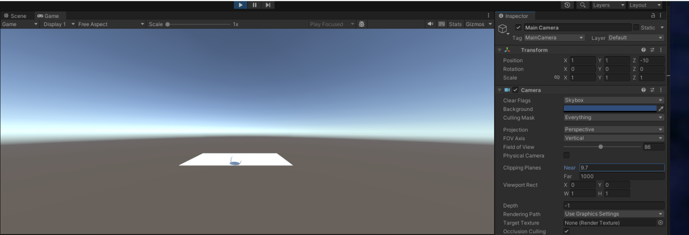
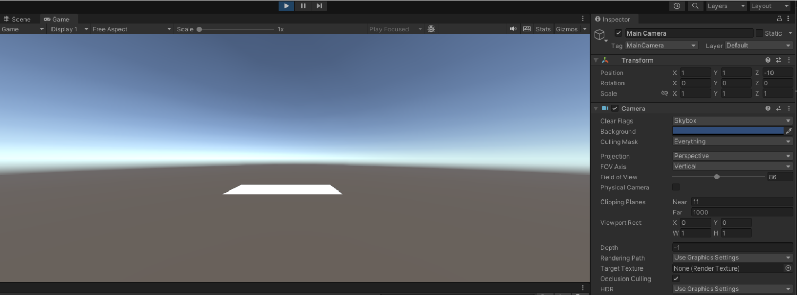

Respuestas a las preguntas ponderadas:


1. Translate, Rotate y localScale.


2. Se haría de la siguiente manera:

```
transform.Translate(transform.position * 2);
transform.Rotate(transform.up * 30);
```

No se obtendría el mismo resultado pues en las transformaciones en unity el orden importa.

3. 


4. 


5. Cuanto menor sea, mayores se renderizan los objetos porque los planos de proyección serán más pequeños.

6. Es cierto ya que en el modo ortográfico se elimina la perspectiva, representando todos los objetos con tamaños proporcionales. Se puede acceder a esta vista desde el inspector haciendo click en la caja central del gizmo localizado en la esquina superior derecha. 

7. camera.transform.rotation = Quaternion.Euler(0f, 30f * Mathf.Deg2Rad, 0f)

8. Se accede al atributo ‘projectionMatrix’ de la cámara que se quiere estudiar dentro de update (para así acceder a la matriz del último frame), el cual devolverá una Matrix4x4 con los datos pedidos (se puede mostrar esta por consola).

9. Se accede a ella de forma igual que en el caso anterior, la única diferencia siendo que la propia cámara tiene que ser de vista ortogonal.

10. Accediendo al atributo ‘localToWorldMatrix’ del Transform del GameObject que se pretende estudiar (el cual se debe guardar dentro de una Matrix4x4).

11. Para acceder a la matriz del sistema de referencia de la vista, es decir, la cámara, se usa la función Camera.worldToCameraMatrix

12.   ``` 0.97428        0.00000        0.00000        0.00000
      0.00000        1.73205        0.00000        0.00000
      0.00000        0.00000        -1.00060        -0.60018
      0.00000        0.00000        -1.00000        0.00000
      ```

13.  ```1.00000        0.00000        0.00000        0.00000
      0.00000        1.00000        0.00000        0.00000
      0.00000        0.00000        1.00000        0.00000
      0.00000        0.00000        0.00000        1.00000
     ```
14. ```-0.38625        -0.72351        0.57214        -2.40000
      0.00000        0.62027        0.78438        0.25798
     -0.92239        0.30297        -0.23958        3.03000
      0.00000        0.00000        0.00000        1.00000
      ```
15. Las coordenadas del sistema de referencia vienen dadas por la propia posición del objeto, cosa que podemos obtener si accedemos a transform.position y la rotación en transform.rotation